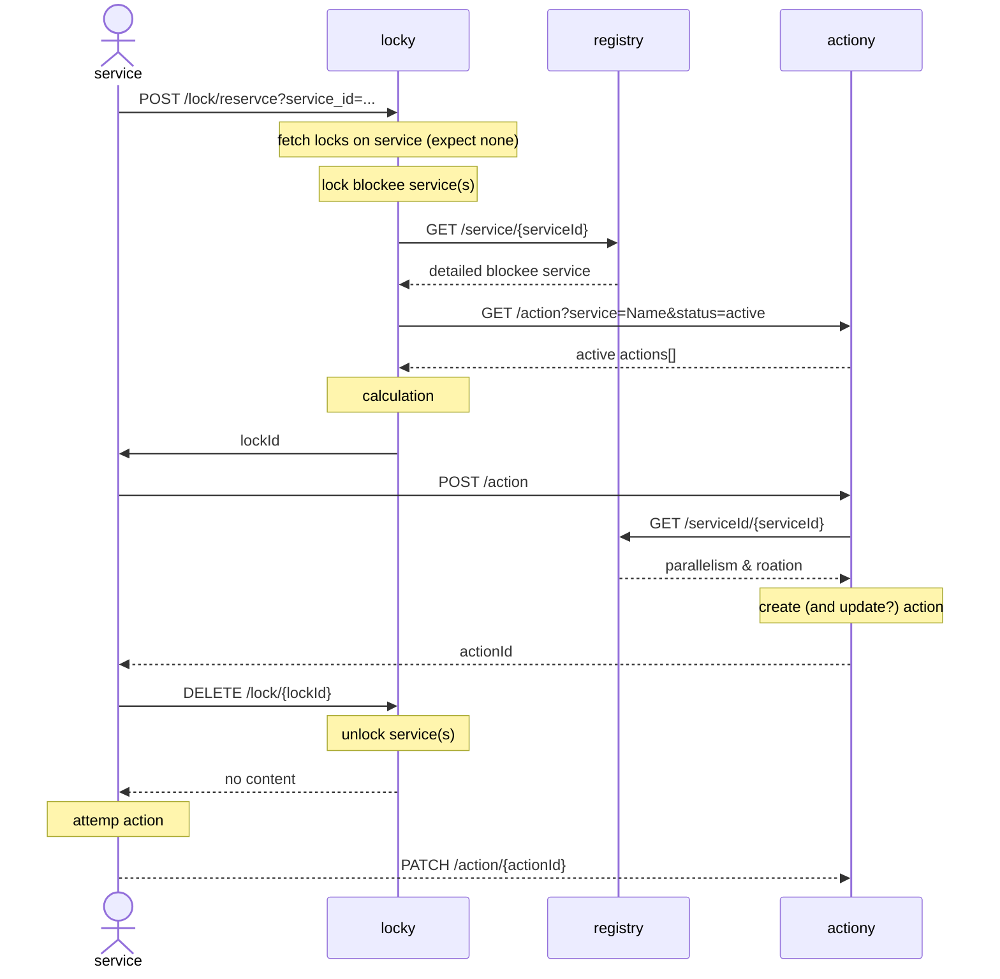

# arstotzka

Provides state management in the vector ecosystem, the logic is separated into 3 microservices, `actiony`, `locky` and `registry`.

The main goal of `arstotzka` is to provide a clear immediate view of the vector ecosystem at all times by monitoring and controlling the activity of the services registered in the ecosystem.

## Terminology
state - an incrementing integer coupled to a chunk of changes in an osm database.

service - a server, job or a cron-job managing a data source who's consuming or producing changes i.e. states. services might have a parent and or children.

action - when a service is active it produces an action, a process taking place in the vector ecosystem, each action has a state.
service is consuming chunks of changes and being "synced" up to that state. once a service is "synced" up to some state it's children are able to consume those changes as well.

blocker/blockee - some services shouldn't be active in parallel with another. a blockee service is one who, or that which, is blocked by a blocker service.

lock - to prevent a race condition between a blocker and blockee services in the moments between access reservation and action creation, we introduce locks. each interaction with `locky` will first invoke a check for non expired locks on the requesting service - if there are none, a lock on the blockees of the requesting service will be created.
the lock can be lifted once the action on the service has been created or `reserveLockExpiration` has passed.

rotation - an incrementing integer attached to each service, each rotation is of a continuous version of changes to a service. once the data continuity is broken a new rotation should be published. due to the tree-like build ecosystem, a rotation bump to a service bumps all of its descendents.

## How does it work
- `locky` manages the accessibility of services to be active at a point of time
- `actiony` manages CRUD operations of actions
- `registry` holds namespace configuration to promise services to act only within their namespace, each namespace is decoupled from the other

1. a service is up in the ecosystem, a serviceId is provided by configuration and by interacting with `arstotzka` it's identity will be clear

2. the service reserves access from `locky` validating that it's free to act within the namespace and create a lock on the services that shouldn't act parallel to that service (the blockees).

3. `locky` will validate if the requesting service has any non expired locks on it or any active blocking services and lock any services that should not act in parallel to it. the request will result in a lockId who's locking the blockees.

4. having access from `locky` the service will post a new action request to `actiony` who validates the service self parallelism - creates a newly active action or conflicts. from now on the service is active within its namespace.

5. being aware to the newly created active action of the service, the lock identified by lockId (created on stage 3) can be removed from `locky`. any services that should not act at the same time as the requesting service will be shut by that active action when reserving access from `locky`.

6. the action status will be patched accordingly to completed or failed in time by the service



## Configuration
### locky:
- `app.reserveLockExpiration` - the expiration time in ms for a service reserving access
- `app.serviceToActionsUrlMap` - map of unique services whose actions are not saved on `actiony` (e.g. ingestion)

### registry:
- `app.rotationLockExpiration` - the expiration time in ms for a rotation bump to take place
- `app.serviceToActionsUrlMap` - map of unique services whose actions are not saved on `actiony` (e.g. ingestion)

### common
- `mediator.enableRetryStrategy` - flag for retry strategy activation
- `mediator.retryStrategy.retries` - the number of maximum retries before failing
- `mediator.retryStrategy.shouldResetTimeout` - determines if the timeout should be reset between retries
- `mediator.retryStrategy.delay` - the delay in milliseconds between retried requests
- `mediator.retryStrategy.isExponential` - exponential retry timeout between retried requests
- `actiony.url` - actiony endpoint url
- `locky.url` - locky endpoint url
- `registry.url` - registry endpoint url

## Database diagram


## commander.Dockerfile

### environment variables:
- COMMAND: the command to be executed as a `package.json` script name of one or more of the selected `SCOPES`
- SCOPES: a list of packages for the `COMMAND` to run in. comma separated with no spaces. (currently executing on a single package will have to be passed with a single comma as suffix e.g. "registry," due to lerna filtering the scope argument)

the following will be invoked:
`lerna run $COMMAND --scope={$SCOPES}`

## Migrations
```
docker run -e COMMAND=migration:run -e SCOPES=registry,locky,actiony arstotzka-commander:latest
```

## Seed
prepare your namespace seed input file, [see example](packages/registry/namespace-seeder-example.json) and locate it in `$HOME/arstotzka-namespace-seeder.json`

```
docker run -e COMMAND=seed -e SCOPES=registry, -v ~/packages/registry/namespace-seeder-example.json:/root/arstotzka-namespace-seeder.json arstotzka-commander:latest
```

## Development
This repository is a monorepo managed by [`Lerna`](https://lerna.js.org/) and separated into multiple independent packages


### Building
```
npx lerna run build
```

### Run Tests
```
npx lerna run test
```
